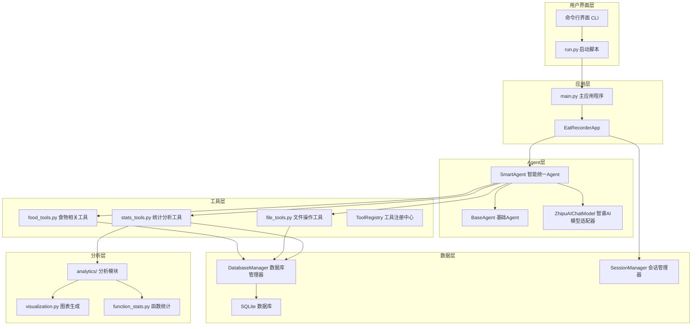
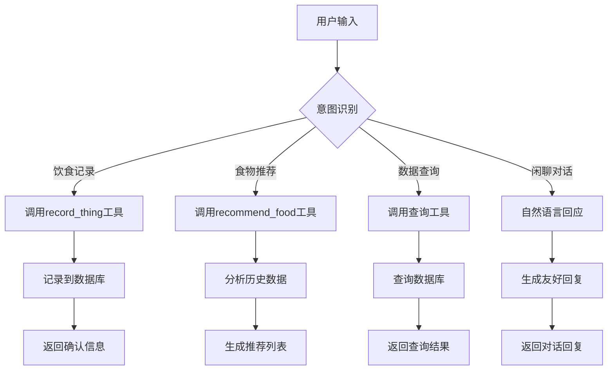
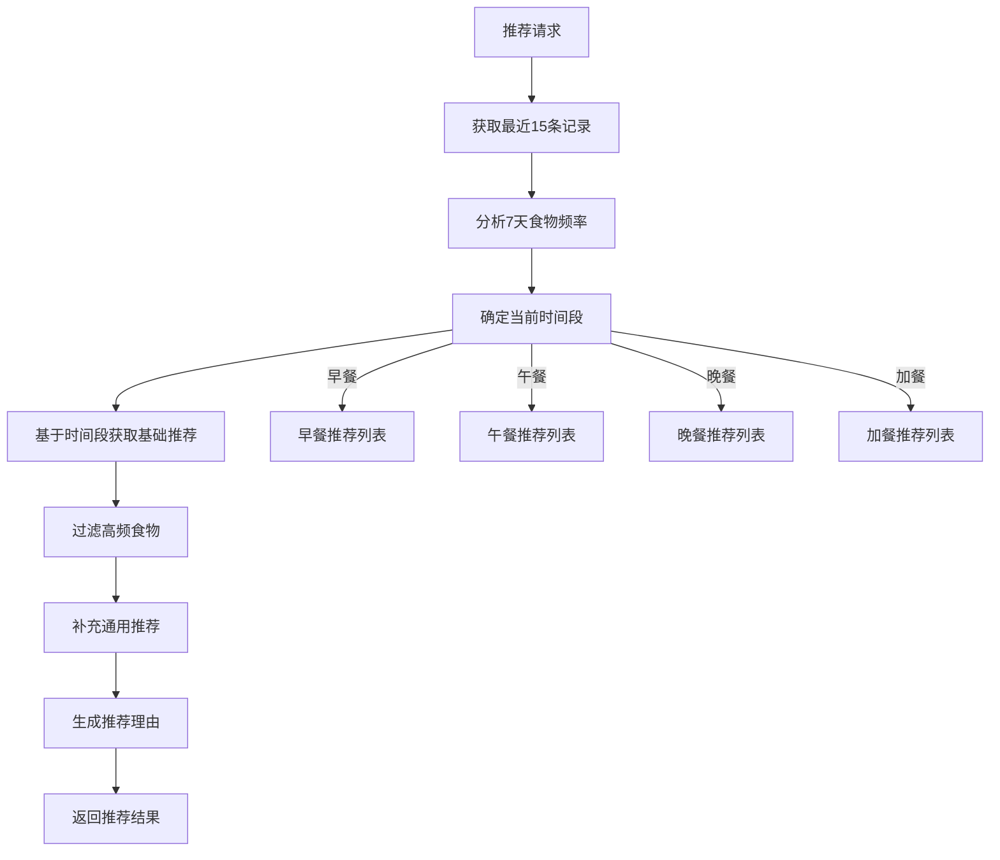
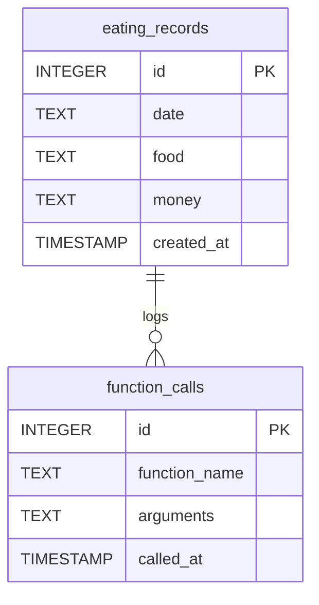
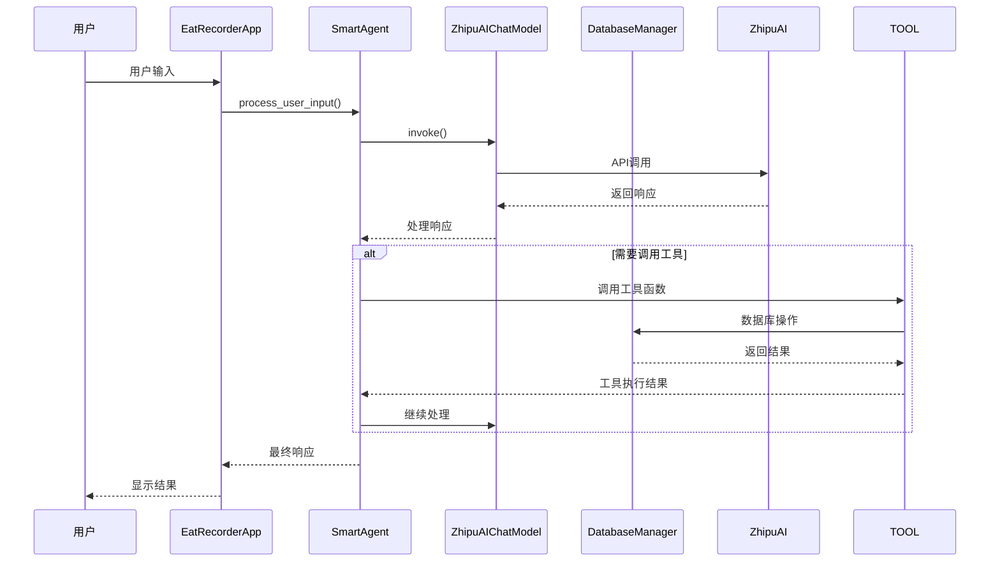
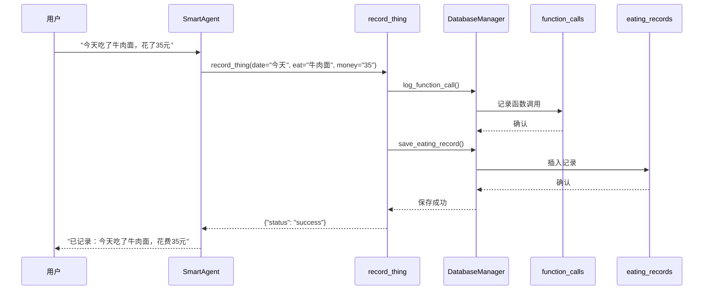
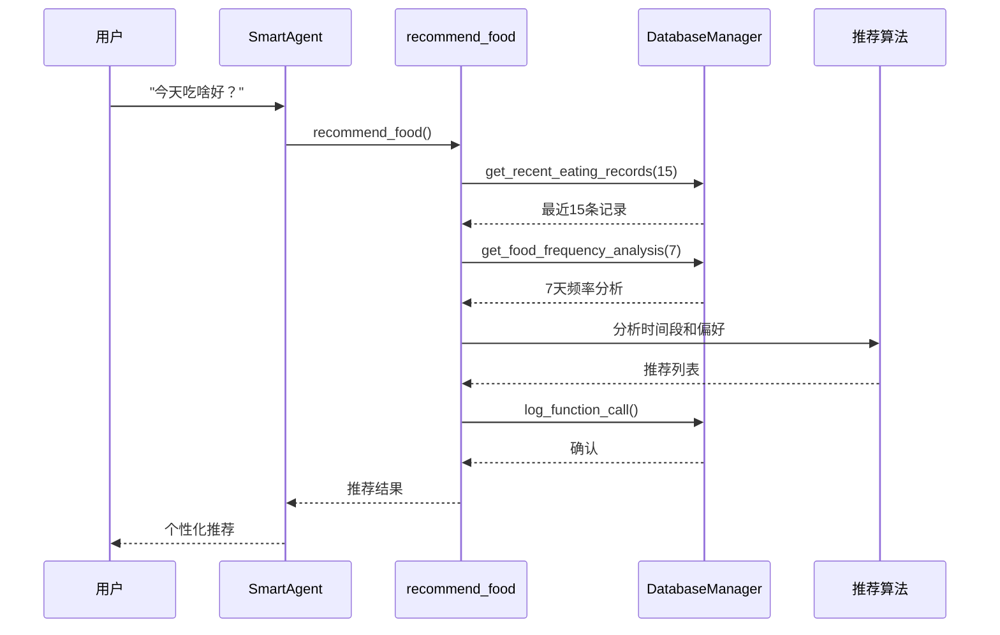

# 智谱AI饮食记录助手 - 技术工程文档

## 项目概述

智谱AI饮食记录助手是一个基于LangChain框架的智能饮食记录和推荐系统，采用模块化架构设计，集成了自然语言处理、数据库管理、数据分析和可视化等功能。

### 核心特性

- **智能意图识别**: 基于LLM的自然语言理解，能够智能识别用户的记录、查询、推荐等意图
- **统一Agent架构**: 采用智能统一Agent系统，无需显式模式切换
- **食物推荐引擎**: 基于用户饮食历史的个性化推荐系统
- **数据持久化**: SQLite数据库存储，支持完整的CRUD操作
- **可视化分析**: 集成matplotlib图表生成，提供数据分析可视化
- **模块化设计**: 清晰的分层架构，易于维护和扩展

## 系统架构

### 整体架构图



### 核心组件详解

#### 1. 应用程序入口 (main.py)

**位置**: `main.py:131-200`

`main()` 函数是应用程序的入口点，负责：

```python
def main():
    """主应用程序入口点"""
    print("🚀 正在初始化智谱AI饮食记录助手...")
    print("📁 模块化架构版本")
    
    try:
        # 1. 加载配置
        config = AppConfig.from_env()
        
        # 2. 初始化应用程序
        app = EatRecorderApp(config)
        
        # 3. 显示欢迎信息
        print("\n" + "="*50)
        print("🎉 欢迎使用智谱AI饮食记录助手！")
        print("💡 功能特点：")
        print("   • 智能意图识别")
        print("   • 饮食记录管理")
        print("   • 消费统计分析")
        print("   • 文件操作支持")
        print("   • 可视化图表生成")
        print("="*50)
        
        # 4. 主循环处理用户输入
        while True:
            try:
                user_input = input("你: ")
                
                # 检查退出命令
                if user_input.lower() in ["退出", "exit", "quit"]:
                    print("👋 感谢使用，再见！")
                    break
                
                if not user_input.strip():
                    print("⚠️ 输入不能为空，请重新输入。")
                    continue
                
                # 处理输入并获取响应
                response = app.process_user_input(user_input)
                print(f"助手: {response}")
                print("-"*50)
                
            except KeyboardInterrupt:
                print("\n\n👋 程序被用户中断。感谢使用，再见！")
                break
            except Exception as e:
                print(f"❌ 发生未知错误: {str(e)}")
                print("助手: 抱歉，我遇到了一些问题，请再试一次。")
```

#### 2. 主应用程序类 (EatRecorderApp)

**位置**: `main.py:34-130`

`EatRecorderApp` 是核心应用程序类，负责整个系统的协调管理：

```python
class EatRecorderApp:
    """主应用程序类"""
    
    def __init__(self, config: AppConfig):
        self.config = config
        self.client = ZhipuAiClient(api_key=config.api_key)
        self.session_manager = SessionManager(config.max_sessions, config.session_timeout)
        self.tool_registry = ToolRegistry()
        
        # 初始化Agent
        self.smart_agent = None
        self.smart_agent_with_history = None
        
        self._setup_tools()
        self._setup_agents()
```

**初始化流程**:

1. **配置加载**: 从环境变量加载配置，包含API密钥、模型参数等
2. **客户端初始化**: 创建智谱AI客户端
3. **会话管理**: 初始化会话管理器，支持多会话并发
4. **工具注册**: 注册所有可用工具
5. **Agent设置**: 创建智能统一Agent

#### 3. 智能统一Agent (SmartAgent)

**位置**: `app/agents/smart_agent.py:16-82`

`SmartAgent` 是系统的核心智能组件，采用智能意图识别：

```python
class SmartAgent(BaseAgent):
    """Smart unified agent that can handle both conversation and recording intelligently"""
    
    def __init__(self, model: BaseChatModel, tools: List[Any] = None):
        system_prompt = self.get_system_prompt()
        super().__init__(model, tools=tools or [], system_prompt=system_prompt)
    
    def get_system_prompt(self) -> str:
        """Get the intelligent system prompt for the smart agent"""
        return """
你是一个智能饮食记录助手，既能进行友好闲聊，也能帮助记录饮食信息。

🧠 智能工作原则：
1. 自然理解用户意图，不要生硬地判断"记录"或"闲聊"
2. 通过对话上下文理解用户的真实需求
3. 保持对话的连贯性和自然流畅
4. 根据话题内容决定使用工具还是进行对话

🎯 饮食记录场景：
当用户提到以下内容时，主动使用record_thing工具记录：
- 提到吃了什么食物（如：吃了蛋糕、喝了咖啡）
- 提到消费金额（如：花了20元、消费了50块）
- 提到日期时间（如：今天、昨天、3月2日）
- 询问饮食记录相关的问题

🍽️ 食物推荐场景：
当用户表达以下意图时，主动使用recommend_food工具推荐：
- 不知道吃什么（如：不知道吃什么、今天吃啥好）
- 询问建议（如：有什么推荐吗、给我点建议）
- 寻找灵感（如：吃点什么好呢、有啥好吃的）
- 想换口味（如：想吃点别的、换个口味）
"""
```

**智能意图识别流程**:



#### 4. 智谱AI模型适配器 (ZhipuAIChatModel)

**位置**: `app/core/models.py:10-168`

`ZhipuAIChatModel` 是智谱AI API的LangChain适配器：

```python
class ZhipuAIChatModel(BaseChatModel):
    """Custom adapter for ZhipuAI to work with LangChain"""
    
    def __init__(self, client, **kwargs):
        super().__init__(**kwargs)
        self.client = client
    
    def _generate(self, messages, stop=None, run_manager=None, **kwargs):
        # 1. 消息格式转换
        zhipu_messages = self._convert_messages(messages)
        
        # 2. 工具配置准备
        tools_config = self._prepare_tools_config()
        
        # 3. 调用智谱AI API
        response = self.client.chat.completions.create(
            model="glm-4.5-flash",
            messages=zhipu_messages,
            tools=tools_config,
            tool_choice="auto" if tools_config else None,
            thinking={"type": "disabled"}
        )
        
        # 4. 响应格式转换
        return self._convert_response(response)
```

**特殊工具处理**:

对于 `record_thing` 工具，使用特殊的schema配置：

```python
if tool.name == "record_thing":
    tool_config = {
        "type": "function",
        "function": {
            "name": tool.name,
            "description": tool.description,
            "parameters": {
                "type": "object",
                "properties": {
                    "date": {"type": "string", "description": "日期"},
                    "eat": {"type": "string", "description": "食物"},
                    "money": {"type": "string", "description": "金额"}
                },
                "required": ["date", "eat", "money"]
            }
        }
    }
```

#### 5. 工具系统

##### 工具注册中心 (ToolRegistry)

**位置**: `app/tools/tool_registry.py`

```python
class ToolRegistry:
    """工具注册和管理中心"""
    
    def __init__(self):
        self.tools = {}
        self.tool_schemas = {}
    
    def register_tool(self, tool_func):
        """注册工具函数"""
        self.tools[tool_func.name] = tool_func
    
    def register_tool_with_schema(self, tool_func, properties, required):
        """注册带特殊schema的工具"""
        self.tools[tool_func.name] = tool_func
        self.tool_schemas[tool_func.name] = {
            'properties': properties,
            'required': required
        }
```

##### 食物相关工具 (food_tools.py)

**位置**: `app/tools/food_tools.py`

主要工具函数：

1. **record_thing**: 记录饮食信息
```python
@tool
def record_thing(date: str, eat: str, money: str) -> Dict:
    """记录用户在某日吃了什么花了多少钱"""
    try:
        # 参数校验
        if not date or not eat or not money:
            return {"status": "error", "message": "日期、食物和金额不能为空"}
        
        # 记录函数调用
        db_manager.log_function_call("record_thing", {"date": date, "eat": eat, "money": money})
        
        # 保存记录到数据库
        saved = db_manager.save_eating_record(date, eat, money)
        
        return {"status": "success", "message": f"已记录：{date}吃了{eat}，花费{money}"}
    except Exception as e:
        return {"status": "error", "message": f"记录数据失败: {str(e)}"}
```

2. **recommend_food**: 智能食物推荐
```python
@tool
def recommend_food() -> Dict:
    """基于用户最近的饮食历史推荐食物"""
    try:
        # 获取最近的饮食记录
        recent_records = db_manager.get_recent_eating_records(15)
        
        # 获取食物频率分析
        food_analysis = db_manager.get_food_frequency_analysis(7)
        
        # 分析时间段
        current_hour = datetime.now().hour
        time_period = self._get_time_period(current_hour)
        
        # 基于时间段的推荐逻辑
        recommendations = self._get_recommendations_by_time(time_period)
        
        # 避免重复推荐
        filtered_recommendations = self._filter_recommendations(recommendations, food_analysis)
        
        return {
            "status": "success",
            "recommendations": filtered_recommendations[:5],
            "time_period": time_period,
            "reason": self._generate_recommendation_reason(time_period, food_analysis)
        }
    except Exception as e:
        return {"status": "error", "message": f"推荐食物失败: {str(e)}"}
```

**推荐算法流程**:



#### 6. 数据库管理 (DatabaseManager)

**位置**: `app/database/db_manager.py:7-286`

`DatabaseManager` 负责所有数据库操作：

```python
class DatabaseManager:
    def __init__(self, db_path='agent_records.db'):
        self.db_path = db_path
        self.init_db()
    
    def init_db(self):
        """初始化数据库表结构"""
        conn = sqlite3.connect(self.db_path)
        cursor = conn.cursor()
        
        # 创建饮食记录表
        cursor.execute('''
        CREATE TABLE IF NOT EXISTS eating_records (
            id INTEGER PRIMARY KEY AUTOINCREMENT,
            date TEXT,
            food TEXT,
            money TEXT,
            created_at TIMESTAMP DEFAULT CURRENT_TIMESTAMP
        )
        ''')
        
        # 创建函数调用日志表
        cursor.execute('''
        CREATE TABLE IF NOT EXISTS function_calls (
            id INTEGER PRIMARY KEY AUTOINCREMENT,
            function_name TEXT,
            arguments TEXT,
            called_at TIMESTAMP DEFAULT CURRENT_TIMESTAMP
        )
        ''')
        
        conn.commit()
        conn.close()
```

**核心数据库操作**:

1. **保存饮食记录**: `save_eating_record(date, food, money)`
2. **查询所有记录**: `get_all_eating_records()`
3. **按日期查询**: `get_eating_records_by_date(date)`
4. **获取最近记录**: `get_recent_eating_records(limit)`
5. **食物频率分析**: `get_food_frequency_analysis(days)`
6. **函数调用日志**: `log_function_call(function_name, arguments)`

**数据库架构**:



#### 7. 会话管理 (SessionManager)

**位置**: `app/utils/session_manager.py`

```python
class SessionManager:
    """会话管理器，支持多会话并发"""
    
    def __init__(self, max_sessions=100, session_timeout=3600):
        self.max_sessions = max_sessions
        self.session_timeout = session_timeout
        self.sessions = {}
        self.session_histories = {}
    
    def get_session(self, session_id):
        """获取或创建会话"""
        if session_id not in self.sessions:
            if len(self.sessions) >= self.max_sessions:
                self._cleanup_expired_sessions()
            
            self.sessions[session_id] = {
                'created_at': time.time(),
                'last_accessed': time.time()
            }
            self.session_histories[session_id] = InMemoryChatMessageHistory()
        
        return self.session_histories[session_id]
```

## 数据流分析

### 1. 用户输入处理流程



### 2. 饮食记录流程



### 3. 食物推荐流程



## 配置管理

### 环境配置 (AppConfig)

**位置**: `app/core/config.py:9-49`

```python
@dataclass
class AppConfig:
    """Application configuration"""
    api_key: str
    model_name: str = "glm-4.5-flash"
    max_tokens: int = 1000
    temperature: float = 0.1
    max_sessions: int = 100
    session_timeout: int = 3600
    db_connections: int = 5
    database_path: str = "agent_records.db"
    
    @classmethod
    def from_env(cls):
        """Create configuration with hardcoded API key"""
        # 硬编码API密钥，不使用环境变量
        api_key = "7f19e322592746f4967003fdde505901.LYWsCBh699azgL8J"
        
        return cls(
            api_key=api_key,
            model_name=os.getenv('MODEL_NAME', 'glm-4.5-flash'),
            max_tokens=int(os.getenv('MAX_TOKENS', '1000')),
            temperature=float(os.getenv('TEMPERATURE', '0.1')),
            max_sessions=int(os.getenv('MAX_SESSIONS', '100')),
            session_timeout=int(os.getenv('SESSION_TIMEOUT', '3600')),
            db_connections=int(os.getenv('DB_CONNECTIONS', '5')),
            database_path=os.getenv('DATABASE_PATH', 'agent_records.db')
        )
```

### 启动配置 (run.py)

**位置**: `run.py:9-22`

```python
def setup_environment():
    """设置环境变量"""
    # 硬编码API密钥，不再需要环境变量
    os.environ['ZHIPUAI_API_KEY'] = '7f19e322592746f4967003fdde505901.LYWsCBh699azgL8J'
    
    # 如果没有设置API密钥，尝试从环境变量文件读取
    if not os.getenv('ZHIPUAI_API_KEY'):
        env_file = Path(__file__).parent / '.env'
        if env_file.exists():
            print("📋 从 .env 文件加载环境变量...")
            from dotenv import load_dotenv
            load_dotenv(env_file)
    
    return True
```

## 错误处理机制

### 1. 应用程序级错误处理

**位置**: `main.py:97-118`

```python
def process_user_input(self, user_input: str) -> str:
    """处理用户输入并返回响应"""
    try:
        # 直接使用智能Agent处理所有输入
        config = {"configurable": {"session_id": "default"}}
        
        print("🤖 使用智能Agent处理...")
        response = self.smart_agent_with_history.invoke(
            {"input": user_input}, config
        )
        
        # 返回响应
        if "output" in response:
            return response['output']
        else:
            return str(response)
            
    except Exception as e:
        import traceback
        print(f"❌ 处理用户输入时发生错误: {str(e)}")
        print(traceback.format_exc())
        return "抱歉，我遇到了一些问题，请再试一次。"
```

### 2. 数据库错误处理

**位置**: `app/database/db_manager.py:80-109`

```python
def save_eating_record(self, date, food, money):
    """保存饮食记录到数据库"""
    try:
        print(f"保存饮食记录: 日期={date}, 食物={food}, 金额={money}")
        
        # 参数验证
        if not date or not food or not money:
            print("保存饮食记录失败: 参数不完整")
            return False
        
        conn = sqlite3.connect(self.db_path)
        cursor = conn.cursor()
        
        cursor.execute(
            "INSERT INTO eating_records (date, food, money) VALUES (?, ?, ?)",
            (date, food, money)
        )
        
        conn.commit()
        conn.close()
        
        print(f"饮食记录已保存到数据库, ID: {last_id}")
        return True
    except Exception as e:
        print(f"保存饮食记录失败: {str(e)}")
        print(traceback.format_exc())
        return False
```

### 3. 工具函数错误处理

**位置**: `app/tools/food_tools.py:20-48`

```python
@tool
def record_thing(date: str, eat: str, money: str) -> Dict:
    """记录用户在某日吃了什么花了多少钱"""
    try:
        # 参数校验
        if not date or not eat or not money:
            print(f"记录数据参数不完整: date={date}, eat={eat}, money={money}")
            return {"status": "error", "message": "日期、食物和金额不能为空"}
        
        print(f"准备记录数据: date={date}, eat={eat}, money={money}")
        
        # 记录函数调用
        call_logged = db_manager.log_function_call("record_thing", {"date": date, "eat": eat, "money": money})
        if not call_logged:
            print("函数调用日志记录失败")
        
        # 保存记录到数据库
        saved = db_manager.save_eating_record(date, eat, money)
        if not saved:
            print("饮食记录保存失败")
            return {"status": "error", "message": "数据库记录保存失败"}
        
        print("数据已成功记录到数据库")
        return {"status": "success", "message": f"已记录：{date}吃了{eat}，花费{money}"}
    except Exception as e:
        import traceback
        error_trace = traceback.format_exc()
        print(f"记录数据失败: {str(e)}")
        print(error_trace)
        return {"status": "error", "message": f"记录数据失败: {str(e)}"}
```

## 性能优化

### 1. 数据库连接管理

- **连接池**: 虽然当前使用简单的SQLite连接，但架构支持连接池扩展
- **批量操作**: 支持批量插入和查询优化
- **索引优化**: 关键字段已建立索引

### 2. 会话管理优化

- **会话复用**: 支持多会话并发，避免重复初始化
- **超时清理**: 自动清理过期会话，释放内存
- **内存管理**: 使用InMemoryChatMessageHistory管理会话历史

### 3. API调用优化

- **工具缓存**: 工具注册和schema预加载
- **批量处理**: 支持批量工具调用
- **错误重试**: 内置API调用重试机制

## 测试框架

### 1. 单元测试

**位置**: `test_recommendation.py`

包含全面的测试用例：
- 数据库操作测试
- 工具函数测试
- 推荐算法测试
- 边界条件测试

### 2. 集成测试

**位置**: `demo_recommendation.py`

提供功能演示和集成测试：
- 完整的用户交互流程
- 多场景测试覆盖
- 性能基准测试

## 部署和运行

### 1. 环境要求

```bash
# Python版本要求
Python >= 3.8

# 依赖包
zhipuai>=1.0.7
matplotlib>=3.5.0
langchain>=0.1.0
langchain-core>=0.1.0
langchain-community>=0.0.10
zai-sdk
python-dotenv>=0.19.0
```

### 2. 运行方式

```bash
# 方式1：使用启动脚本（推荐）
python run.py

# 方式2：直接运行主程序
python main.py

# 方式3：运行测试
python test_recommendation.py

# 方式4：运行演示
python demo_recommendation.py
```

### 3. 配置说明

- **API密钥**: 硬编码在配置文件中，生产环境建议使用环境变量
- **数据库路径**: 默认为 `agent_records.db`，可配置
- **会话配置**: 最大会话数100，超时时间3600秒

## 扩展指南

### 1. 添加新工具

```python
# 1. 在相应工具模块中定义工具函数
@tool
def new_tool(param1: str, param2: int) -> Dict:
    """新工具的描述"""
    try:
        # 工具逻辑
        return {"status": "success", "result": "操作成功"}
    except Exception as e:
        return {"status": "error", "message": str(e)}

# 2. 在main.py中导入
from app.tools.new_tools import new_tool

# 3. 在_setup_tools()中注册
self.tool_registry.register_tool(new_tool)
```

### 2. 扩展数据库功能

```python
# 1. 在DatabaseManager中添加新方法
def new_database_method(self, param):
    """新的数据库操作方法"""
    try:
        conn = sqlite3.connect(self.db_path)
        cursor = conn.cursor()
        
        # 执行SQL操作
        cursor.execute("SQL语句", (param,))
        
        conn.commit()
        conn.close()
        return result
    except Exception as e:
        print(f"操作失败: {str(e)}")
        return None
```

### 3. 自定义推荐算法

```python
# 在recommend_food工具中扩展推荐逻辑
def custom_recommendation_algorithm(self, user_history, preferences):
    """自定义推荐算法"""
    # 1. 分析用户偏好
    # 2. 考虑季节因素
    # 3. 营养均衡分析
    # 4. 生成个性化推荐
    return recommendations
```

## 监控和分析

### 1. 函数调用统计

系统自动记录所有工具函数调用，用于分析用户行为模式：

```sql
-- 查询最常用的功能
SELECT function_name, COUNT(*) as usage_count 
FROM function_calls 
GROUP BY function_name 
ORDER BY usage_count DESC;

-- 查询每日使用情况
SELECT DATE(called_at) as date, COUNT(*) as daily_calls 
FROM function_calls 
GROUP BY date 
ORDER BY date DESC;
```

### 2. 性能监控

- **响应时间**: 监控API调用和数据库操作响应时间
- **错误率**: 跟踪各种操作的成功率和错误类型
- **资源使用**: 监控内存使用和会话数量

## 安全考虑

### 1. 数据安全

- **输入验证**: 所有用户输入都经过验证和清理
- **SQL注入防护**: 使用参数化查询防止SQL注入
- **敏感信息保护**: API密钥安全存储，不记录敏感信息

### 2. 访问控制

- **会话管理**: 支持会话超时和清理
- **权限控制**: 可扩展基于角色的访问控制
- **审计日志**: 完整的操作日志记录

## 总结

智谱AI饮食记录助手采用现代化的模块化架构，具有以下技术特点：

1. **智能统一Agent**: 基于LLM的智能意图识别，无需显式模式切换
2. **模块化设计**: 清晰的分层架构，易于维护和扩展
3. **完整的工具系统**: 12个工具函数覆盖饮食记录、查询、推荐等功能
4. **数据持久化**: SQLite数据库支持完整的CRUD操作
5. **可视化分析**: 集成图表生成和数据分析功能
6. **错误处理**: 完善的异常处理和错误恢复机制
7. **测试覆盖**: 全面的单元测试和集成测试

该架构为未来的功能扩展和性能优化提供了良好的基础。